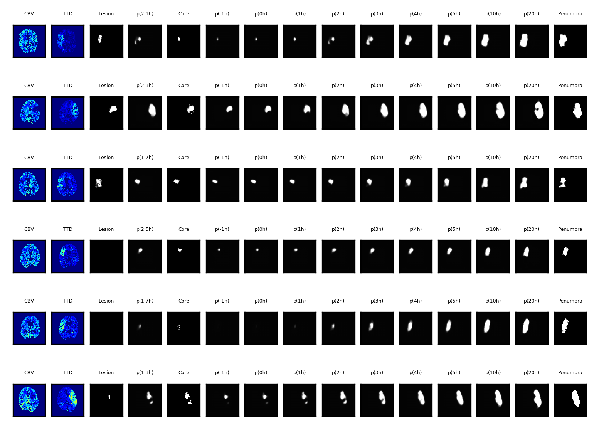

# stroke-prediction
Stroke infarct growth prediction (3D)

## Objective
Learning to Predict Stroke Outcome based on Multivariate CT Images

## Data
The source code is working from within the IMI network at University of Luebeck, as the closed dataset of 29 subjects is only accessable if you are member of the bvstaff group. The filenames have been renamed and cases are represented as a subfolder. CTP modalities CBV and TTD are used as input, corresponding manual segmentations for core and penumbra, as well as follow-up lesion segmentation (FUCTMap). The directory contains more files since the work for the Master's thesis of Linda Aulmann.

The dataset specified in [data.py](data.py) is inherited from [torch.utils.data.Dataset](https://pytorch.org/docs/stable/_modules/torch/utils/data/dataset.html#Dataset), thus can be exchanged with other datasets and loaders (At the moment there are two datasets with different transformations for training and validation). The existing Learners expect 3D pytorch tensors of shape `BxCxDxHxW`, but implementing an own [Learner](learner/Learner.py) will enable the use of 2D data as well.

## Setup
Set up a Python 3.5 environment including the packages of [requirements.txt](requirements.txt) file.

## Structure of repository
The repository consists of the following subfolders:
- common: contains commonly used files such as [DTOs](common/Dto.py)
- learner: contains the [Learner](learner/Learner.py) for running the different trainings
- tester: contains the [Tester](tester/Tester.py) for running the different tests (i.e. inference-only)
- model: contains the models to be learned

Further, there are other important files:
- data.py: defines the dataset as mentioned under section [Data](README.md#data) and contains required transformations
- util.py: contains helper functions

## Usage
Activate the above environment under section [Setup](README.md#setup).

For learning the shape space on the manual segmentations run the following command:

`train_shape_prediction.py ~/tmp/shape_f3.model --epochs 200 --outbasepath ~/tmp/shape --channelscae 1 16 24 32 100 200 0 1 --channelsenc 1 16 24 32 100 200 0 1 --validsetsize 0.275 --fold 17 6 2 26 11 4 1 21 16 27 24 18 9 22 12 0 3 8 23 25 7 10 19`

The `--fold` is an arbitrary but fixed list of indices between 0 and 28 to specify a fold out of the 29 dataset subjects, from which a fraction specified by `--validsetsize` will be used as validation data (e.g. for 0.275 and the above fold it means that 17 training and 6 validation cases are used by the Learner).

Always specify a `--outbasepath` to where files are being saved. This includes the `*.model` file once a new validation minimum has been reached, and `*.png` files that plot the losses, metrics and visualize some samples during the training run:

Train a Unet with the same fold as specified before, to use the Unet segmentation for further training of an adapted encoder to predict on segmentations of unseen CTP modalities:

`train_unet_segmentation.py ~/tmp/unet_f3.model --epochs 200 --outbasepath ~/tmp/unet --channels 2 16 32 64 32 16 32 2 --validsetsize 0.275 --fold 17 6 2 26 11 4 1 21 16 27 24 18 9 22 12 0 3 8 23 25 7 10 19`

To test the trained Unet on some cases, run:

`test_unet_segmentation.py ~/tmp/unet_f3.model --outbasepath ~/tmp/tmp --channels 2 16 32 64 32 16 32 2 --fold 5 13 14 15 20 28`

For comparison pruposes, you can run a shape interpolation via signed distance maps:

`sdm_resampling.py /share/data_zoe1/lucas/Linda_Segmentations/tmp/tmp_unet_f3.model --fold 22 --downsample 0 --groundtruth 1`

